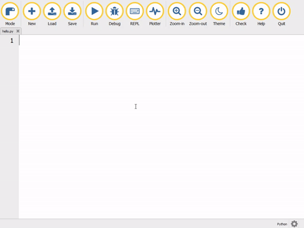

## Introduction

Mu is a very simple to use Python editor and IDE (integrated development environment) for beginners. It's designed to be as user-friendly and helpful as possible for new Python programmers.

You will install [Mu](https://codewith.mu) and learn how to use it to create code.

If you need to print this project, please use the [printer-friendly version](https://projects.raspberrypi.org/en/projects/getting-started-wth-mu/print).
