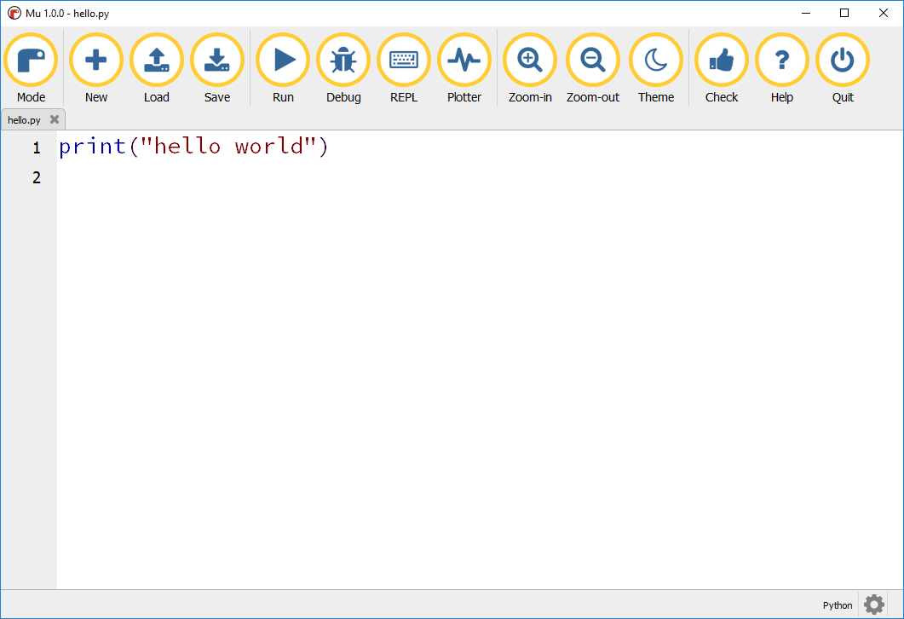

## Introduction

You will install [Mu](https://mu.readthedocs.io/) and learn how to use it to create code.

Mu is a very simple Python editor and IDE (integrated development environment) for beginners, its designed to be as simple and helpful as possible for new Python programmers.

### Additional information for educators

If you need to print this project, please use the [printer-friendly version](https://projects.raspberrypi.org/en/projects/project-name/print){:target="_blank"}.

Use the link in the footer to access the GitHub repository for this project, which contains all resources (including an example finished project) in the 'en/resources' folder.
