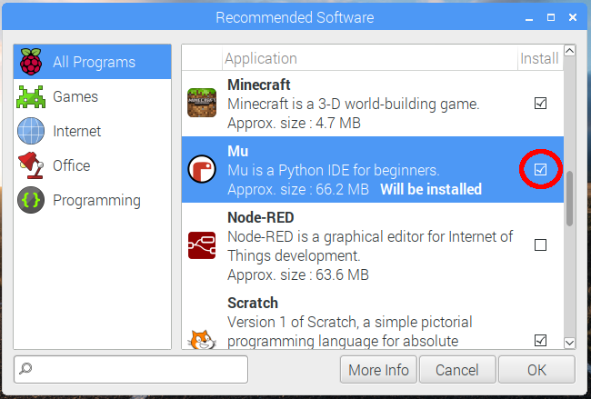
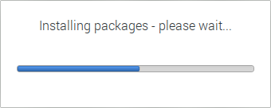
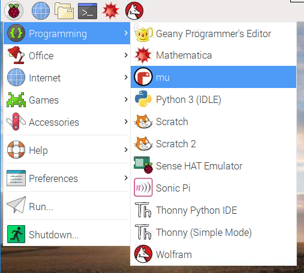
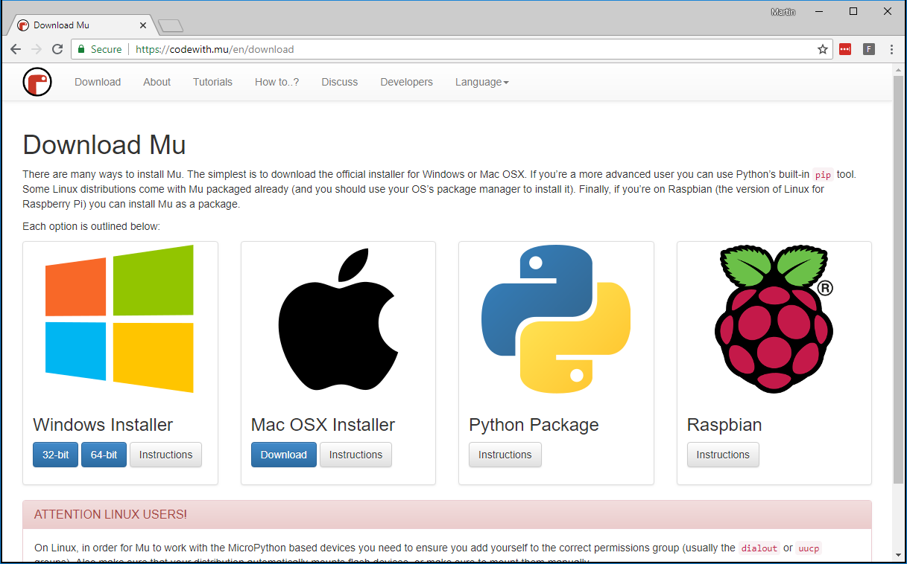
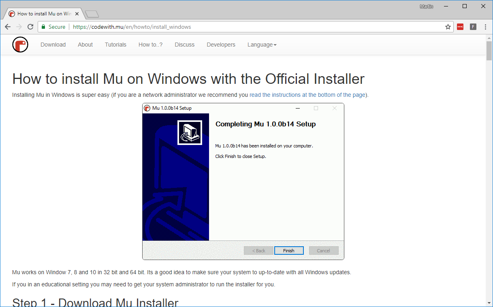
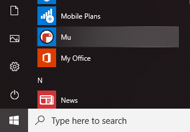
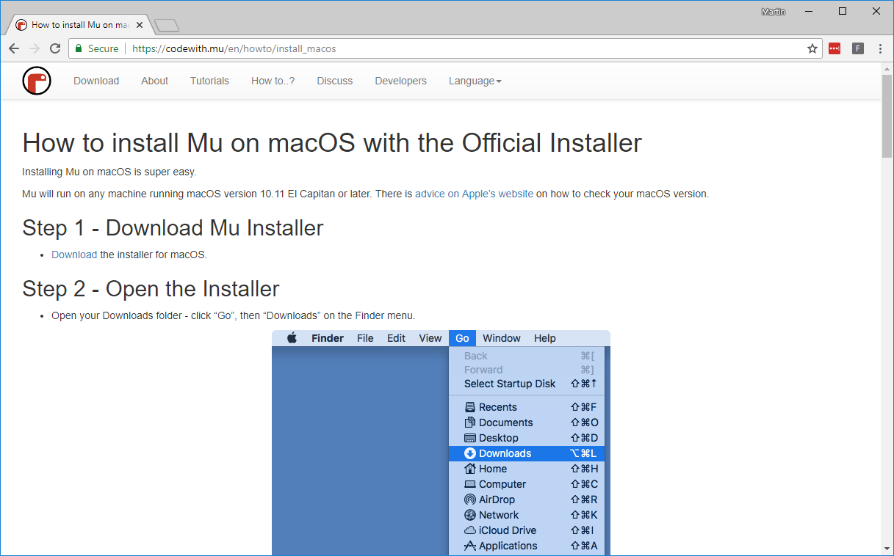
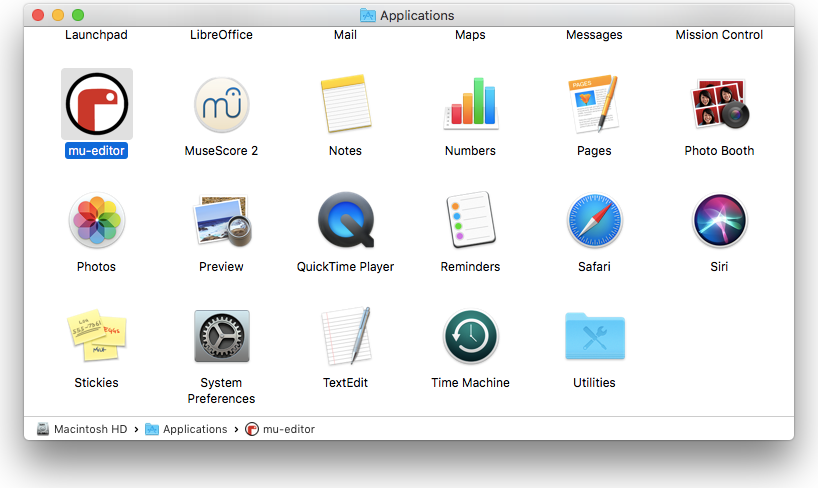
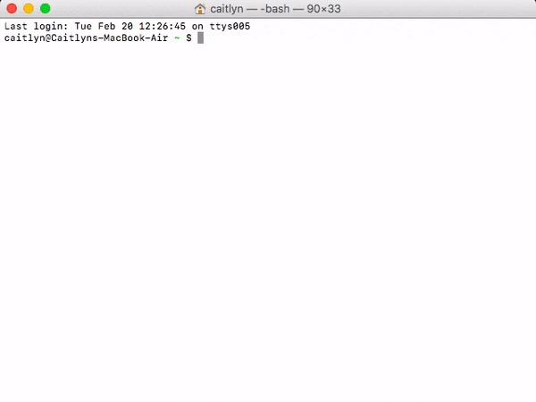

## Installing Mu

[Mu](https://codewith.mu) will work on most operating systems, and you should follow the installation instructions for your operating system.

--- collapse ---

---
title: Raspberry Pi
---

--- task ---

Open the **Recommended Software** application from the **Preferences** menu.


--- /task ---

**Note:** if your version of Raspbian doesn't include the **Recommended Software** application, you should [update your Raspberry Pi](https://www.raspberrypi.org/documentation/raspbian/updating.md) by opening a terminal window and running the commands:

```bash
sudo apt-get update
sudo apt-get dist-upgrade
```

--- task ---

Select Mu from the list of applications to install.



--- /task ---

--- task ---

Click **OK** to start the installation process.



--- /task ---

--- task ---

Start Mu by going to the menu and selecting **Programming** > **Mu**.



--- /task ---

--- /collapse ---

--- collapse ---

---
title: Windows
---

The Mu installer is all you need to get Mu running on your PC and get started with Python programming.

--- task ---

Download the Windows installer from the [codewith.mu/en/download](https://codewith.mu/en/download) page, and follow the [Mu install instructions for Windows](https://codewith.mu/en/howto/install_windows).





--- /task ---

--- task ---

Start Mu by opening it from the Start menu.



--- /task ---

--- /collapse ---

--- collapse ---

---
title: macOS
---

The Mu installer is all you need to get Mu running on your Mac and get started with Python programming.

--- task ---

Download the macOS installer from the [codewith.mu/en/download](https://codewith.mu/en/download) page and follow the [Mu install instructions for macOS](https://codewith.mu/en/howto/install_macos).




--- /task ---

--- task ---

Start Mu by opening it from the Applications menu.



--- /task ---

--- /collapse ---

--- collapse ---

---
title: Linux
---

--- task ---

Open a terminal window.

--- /task ---

--- task ---

Enter this command to install Mu:

```bash
sudo pip3 install mu-editor
```


--- /task ---

--- task ---

Run Mu by entering `mu-editor` into a terminal window.

--- /task ---

--- task ---

To create desktop and application menu shortcuts for Mu, install and run the shortcut utility using these terminal commands:

```bash
sudo pip3 install shortcut
shortcut mu-editor
```

--- /task ---

--- /collapse ---

--- collapse ---

---
title: Advanced: install Mu on Windows/macOS using pip
---

If you already have Python 3 installed, you can use `pip` to install Mu.

--- task ---

### Windows

Click **Start** > **Windows System** > **Command Prompt**, or type 'command' into the Start menu's search bar, to find the application and open a command prompt window.

### macOS

Click **Applications** > **Utilities** > **Terminal**, or type ‘terminal’ into Spotlight Search, to find the application and open a terminal window.

--- /task ---

--- task ---

Enter this command to install the Mu editor:

```bash
pip3 install mu-editor
```




--- /task ---

If you have problems, have a look at our [Using pip on Windows](https://projects.raspberrypi.org/en/projects/using-pip-on-windows) guide.

--- task ---

Run Mu by running `mu-editor` in a command prompt/terminal window.

```bash
mu-editor
```

--- /task ---

--- task ---

To create shortcuts for Mu, install and run the shortcut utility by entering the following into the command prompt/terminal window:

```bash
pip3 install shortcut
shortcut mu-editor
```

--- /task ---

--- /collapse ---
