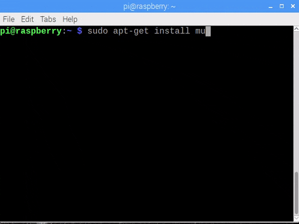

## Installing Mu

[Mu](https://codewith.mu) will work on most operating systems and you should follow the installation instructions for your operating system.

--- collapse ---

---
title: Raspberry Pi
---

--- task ---

Open the **Recommended Software** application from the **Preferences** menu.


--- /task ---

--- task ---

Select Mu from the list of applications to install.


--- /task ---

--- task ---

Click **OK** to start the install.


--- /task ---

**Note:** if your version of Raspbian doesn't include the **Recommended Software** application you should [update your Raspberry Pi](https://www.raspberrypi.org/documentation/raspbian/updating.md) by opening a terminal and running the commands:

```bash
sudo apt-get update
sudo apt-get dist-upgrade
```



--- task ---

Start Mu by going to the menu and selecting **Programming** > **Mu** from the menu.


--- /task ---

--- /collapse ---

--- collapse ---

---
title: Windows
---

The Mu Installer contains all you need to get started programming with Python.

--- task ---

Download the windows installer from the [codewith.mu/en/download](https://codewith.mu/en/download) page.


Select either the 32 bit or 64 bit version depending on your computer.

**Note:** Most modern computers will be 64 bit, but if you dont know download the 32 bit version which will work on either 32 or 64 bit computers.

--- /task ---

--- task ---

Run the installer, by opening your **Downloads** folder and double clicking it.


1. Click **Next** to start.
1. Review the license agreement, and then click **Agree**.
1. Choose whether you want Mu to be available for all users or just you, and click **Next**.
1. Select an installation location and click **Next**.
1. Mu will now install — click **Finish** when the process is complete.

--- /task ---

--- task ---

Run Mu by selecting **Mu** from the Start menu.


--- /task ---

--- collapse ---

---
title: macOS
---

--- task ---

Open a terminal by clicking **Applications** > **Utilities** > **Terminal**, or type 'terminal' into Spotlight Search.

--- /task ---

--- task ---

Enter this command to install Mu:

```bash
pip3 install mu-editor
```


--- /task ---

--- task ---

Run Mu by entering `mu` into the terminal window.

```bash
mu
```

--- /task ---

--- task ---

To create desktop and Launcher shortcuts for mu, install and use the shortcut utility using these commands:

```bash
pip3 install shortcut
shortcut mu
```

--- /task ---

--- /collapse ---

--- collapse ---

---
title: Linux
---

--- task ---

Open a terminal window.

--- /task ---

--- task ---

Enter this command to install Mu:

```bash
sudo pip3 install mu-editor
```


--- /task ---

--- task ---

Run Mu by entering `mu` in the command prompt window.

--- /task ---

--- task ---

To create desktop and application menu shortcuts for Mu, install and use the shortcut utility using these commands:

```bash
sudo pip3 install shortcut
shortcut mu
```

--- /task ---

--- /collapse ---

--- collapse ---

---
title: Advanced - Install using pip
---

content


#### Install using pip

--- task ---

Open a command prompt by clicking **Start** > **Windows System** > **Command Prompt**, or typing 'command' into the Start menu's search bar.


--- /task ---

--- task ---

Enter this command to install the Mu module:

```bash
pip3 install mu-editor
```


--- /task ---

If you have problems, have a look at our [_Using pip on Windows_](https://projects.raspberrypi.org/en/projects/using-pip-on-windows) resource.

--- task ---

Run Mu by entering `mu` into the command prompt.

```bash
mu
```

--- /task ---

--- task ---

To create desktop and Start menu shortcuts for Mu, install and use the shortcut utility by entering the following into the command prompt:

```bash
pip3 install shortcut
shortcut mu
```

--- /task ---

--- /collapse ---


--- /collapse ---