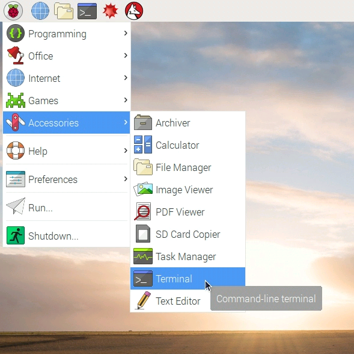

## Installing Mu

Follow the Mu installation guide for your operating system.

--- collapse ---

---
title: Raspbian (Raspberry Pi)
---

--- task ---

Open a terminal window.



--- /task ---

--- task ---

Type in the following command to install Mu.

```bash
sudo apt-get install mu
``` 


--- /task ---

--- task ---

Start Mu by going to the menu and selecting **Programming** > **Mu** from the menu.

--- /task ---

--- /collapse ---

--- collapse ---

---
title: Windows
---

Mu can be installed on Windows using either:

1. A pre-built installer — really useful if Python isn't installed on your computer or your don't have permissions to use the command prompt

2. The command line and `pip` — recommended if you already have Python installed

#### Pre-built installer

The Mu Installer contains all you need to get started programming with Python.

--- task ---

Download the installer - TODO - this needs changing when there is a direct link from the Mu website.

[Windows 64-bit installer](https://s3-eu-west-2.amazonaws.com/mu-builds/windows/mu_2018-03-16_18_52_master_9b119d5_64bit.exe)

[Windows 32-bit installer](https://s3-eu-west-2.amazonaws.com/mu-builds/windows/mu_2018-03-16_18_56_master_9b119d5_32bit.exe)

--- /task ---

--- task ---

1. Run the installer

1. Click **Next** to start.

1. Review the license agreement, and then click **Agree**.

1. Choose whether you want Mu to be available for all users or just you, and click **Next**.

1. Select an installation location and click **Next**.

1. Mu will now install — click **Finish** when the process is complete.


--- /task ---

--- task ---

Run Mu by selecting **Mu** from the Start menu.

--- /task ---

#### Install using pip

--- task ---

Open a command prompt by clicking **Start** > **Windows System** > **Command Prompt**, or typing 'command' into the Start menu's search bar.


--- /task ---

--- task ---

Enter this command to install the Mu module:

```bash
pip3 install mu-editor
```


--- /task ---

If you have problems, have a look at our [_Using pip on Windows_](https://projects.raspberrypi.org/en/projects/using-pip-on-windows) resource.

--- task ---

Run Mu by entering `mu` into the command prompt.

```bash
mu
```

--- /task ---

--- task ---

To create desktop and Start menu shortcuts for Mu, install and use the shortcut utility by entering the following into the command prompt:

```bash
pip3 install shortcut
shortcut mu
```

--- /task ---

--- /collapse ---

--- collapse ---

---
title: macOS
---

--- task ---

Open a terminal by clicking **Applications** > **Utilities** > **Terminal**, or type 'terminal' into Spotlight Search.

--- /task ---

--- task ---

Enter this command to install Mu:

```bash
pip3 install mu-editor
```


--- /task ---

--- task ---

Run Mu by entering `mu` into the terminal window.

```bash
mu
```

--- /task ---

--- task ---

To create desktop and Launcher shortcuts for mu, install and use the shortcut utility using these commands:

```bash
pip3 install shortcut
shortcut mu
```

--- /task ---

--- /collapse ---

--- collapse ---

---
title: Linux
---

--- task ---

Open a terminal window.

--- /task ---

--- task ---

Enter this command to install Mu:

```bash
sudo pip3 install mu-editor
```


--- /task ---

--- task ---

Run Mu by entering `mu` in the command prompt window.

--- /task ---

--- task ---

To create desktop and application menu shortcuts for Mu, install and use the shortcut utility using these commands:

```bash
sudo pip3 install shortcut
shortcut mu
```

--- /task ---

--- /collapse ---
