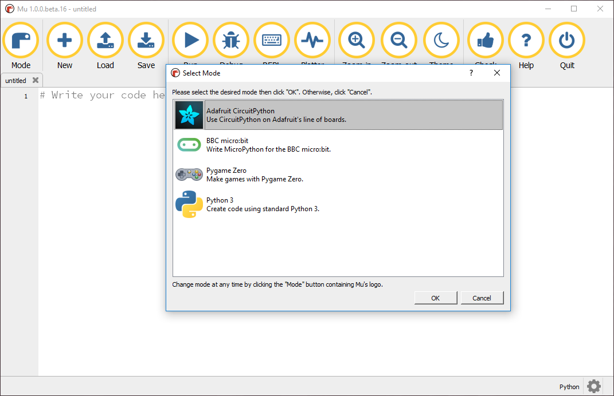
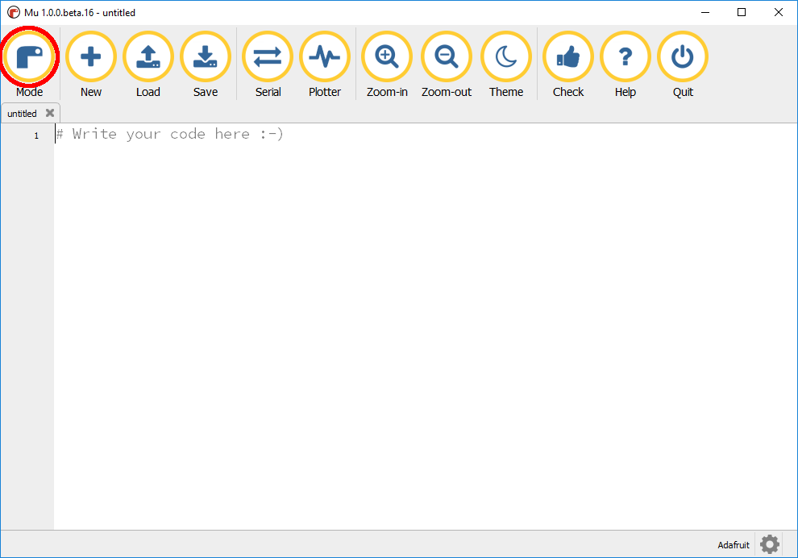

## Mu modes

Mu can be started in one of a number of modes; modes make working with Mu easier by only presenting the options most relevant to what you are planning to use Mu for.

When Mu first starts, you will be presented with the **Select Mode** screen.

--- task ---

Select the **Python 3** mode and click **OK**.

--- /task ---

This will set up Mu for programming in Python 3. If you would like to know more about the different [Mu modes](https://mu.readthedocs.io/en/latest/modes.html), have a look at [mu.readthedocs.io](https://mu.readthedocs.io/en/latest/modes.html).

### Change mode

Mu will remember what mode you select, so you only have to select it once. If you want to change the mode later:

--- task ---

Click on the **Mode** icon in the top-left corder of the screen.

--- /task ---

--- task ---

Select the mode you want from the menu, and click **OK**.

--- /task ---

