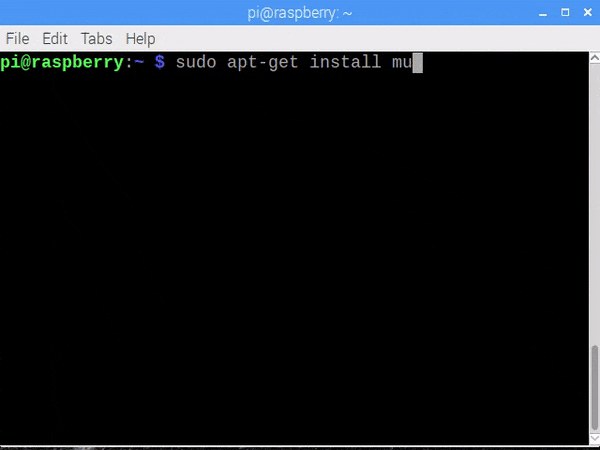
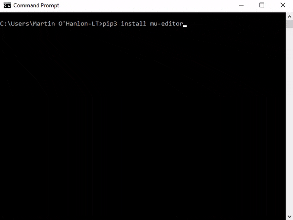
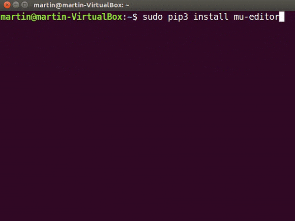

## Installing Mu

Mu installation guides are available for Raspberry Pi, Windows, Mac OS and Linux.

--- collapse ---

---
title: Raspberry Pi
---

### Raspberry Pi

+ Open a terminal


+ Use the following command to install Mu

```bash
sudo apt-get install mu-editor
``` 



+ Start Mu by clicking Programming, Mu on the menu.

--- /collapse ---

--- collapse ---

---
title: Windows
---

Mu can be installed on Windows using either:

+ the command line and `pip` - recommended

+ a pre-built Installer - really useful if you dont have Python installed or permissions to use the command prompt

#### Install using pip

+ Open a command prompt by clicking Start, Windows System, Command Prompt searching for *command*.


+ Enter this command to install the module.

```bash
pip3 install mu-editor
```



If you experience problems, have a look at [Using pip on Windows](https://projects.raspberrypi.org/en/projects/using-pip-on-windows).

+ Run Mu by entering `mu` at the command prompt.

```bash
mu
```

#### Pre-built installer

The Mu Installer contains all you need to get started programming with Python.

+ TODO - download the installer from here!!!!

+ Run the installer, click `Next` to start.

+ Review and `Agree` to the license agreement.

+ Choose whether you want Mu to available for all users or just you and click `Next`.

+ Select an installation location and click `Next`.

+ Mu will now install, click `Finish` when complete.


+ Run Mu by selecting `Mu` from the Start menu.

--- /collapse ---

--- collapse ---

---
title: Apple Mac OS
---

+ Open a terminal by clicking Applications, Utilities, Terminal or searching for *terminal*.

+ Enter this command to install Mu.

```bash
pip3 install mu-editor
```

+ Run My by entering `mu` at the command prompt.

```bash
mu
```

--- /collapse ---

--- collapse ---

---
title: Linux
---

+ Open a terminal.

+ Enter this command to install Mu.

```bash
sudo pip3 install mu-editor
```



+ Run Mu by entering `mu` at the command prompt.

--- /collapse ---