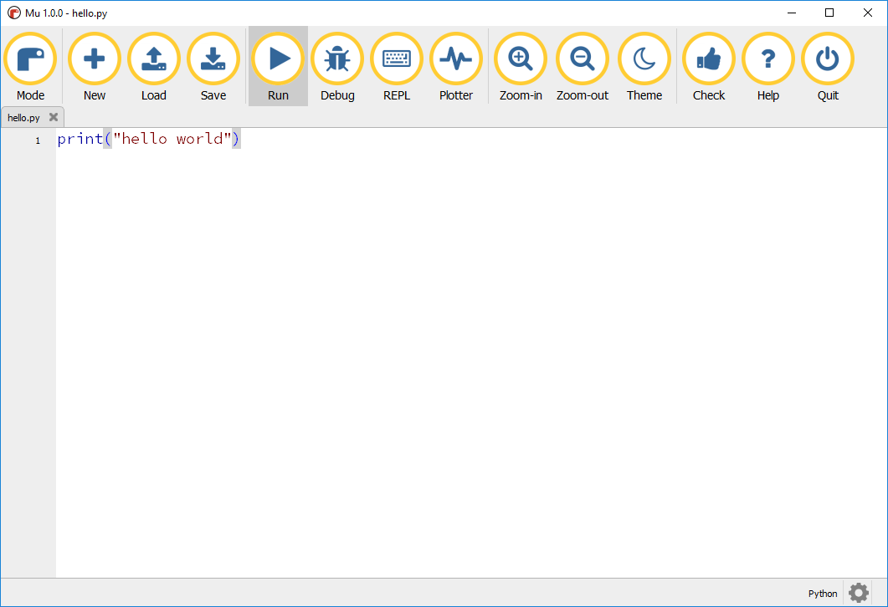
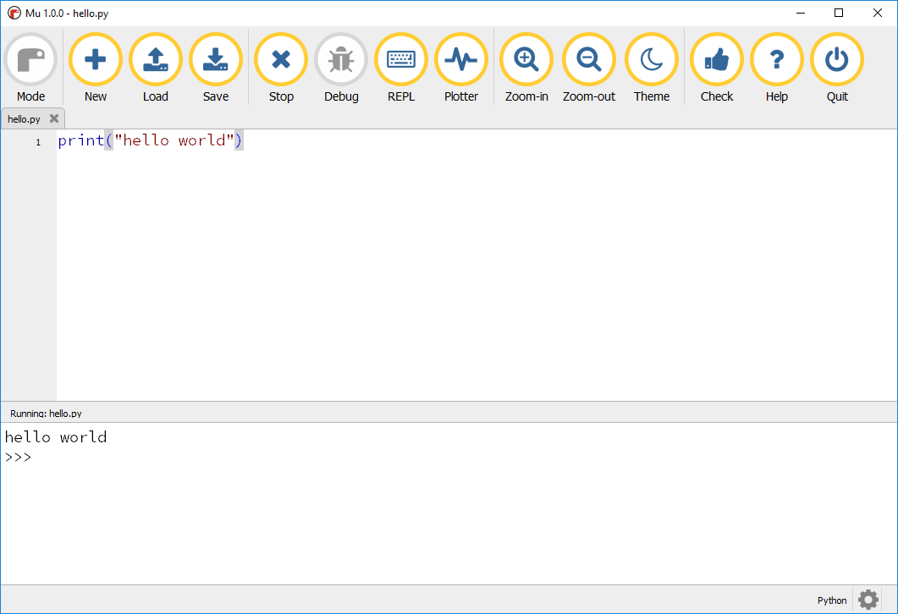

## Writing code in Mu

The main area in Mu is where you will write your code.

--- task ---

Enter this code into Mu to create a 'Hello world' program:

```python
print("hello world")
```


--- /task ---

--- task ---

Click **Save** to save your program.

--- /task ---

--- task ---

Enter the file name `hello` and click **Save**.


--- /task ---

--- task ---

Click **Run** to run your program.



--- /task ---

Your program will run, and the message `hello world` will be displayed.



--- task ---

Stop your program by clicking  **Stop**.

--- /task ---

### Saving your code

Once you have saved your code to a file and given it a name, Mu will automatically save it for you every few seconds, as well as every time you run it. This means that you will probably never lose any work!

You can, of course, also use the **Save** button any time you want.
