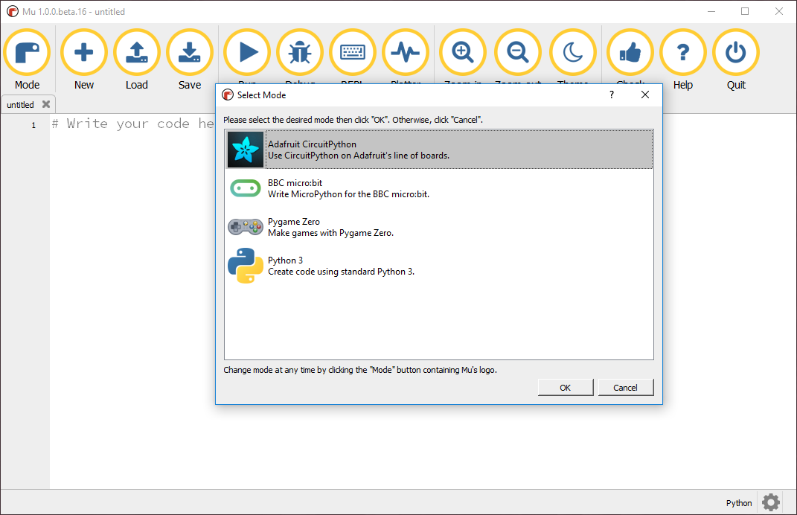
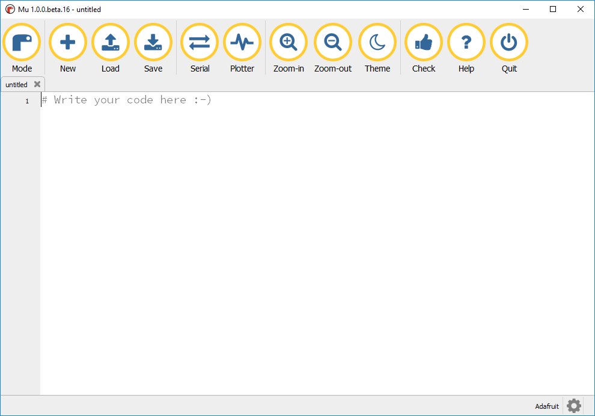

## Mu modes

Mu can be started in one of a number of Modes; modes make working with Mu easier by only presenting the options most relevant to what you are using Mu for.

When Mu first starts you will be presented with the **Select Mode** screen.

+ Select the `Python 3` mode and click `Ok`.

This will setup Mu for programming Python 3. If you would like to know more about the different [Mu modes](https://mu.readthedocs.io/en/latest/modes.html) have a look at [mu.readthedocs.io](https://mu.readthedocs.io/en/latest/modes.html).

### Change mode

Mu will remember what mode you select, so you only have to select it once, if you want to change the made later:

+ Click on the current mode name in the bottom left of the screen.

+ Select the mode you want from the menu and click `Ok`.