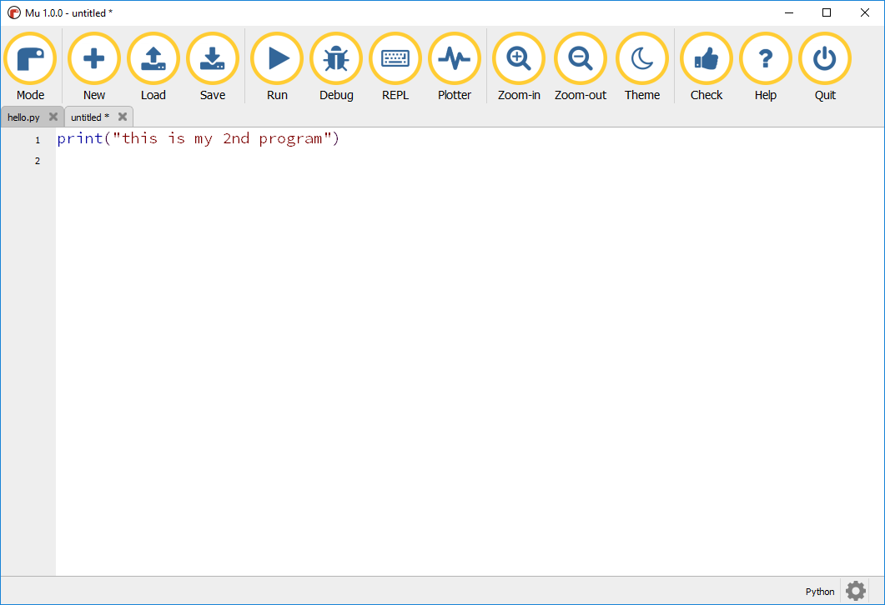

## Creating code with Mu

The main area in Mu is for you to write your code.

+ Enter this code into Mu to say "Hello World".

```python
print("hello world")
```


+ Click `Save` to save your program.

+ Enter the file name `hello` and click `Save`.


+ Click `Run` to run your program.


Your program will run and the message `hello world` will be displayed.


+ Stop you program by clicking `Stop`.

You can have multiple programs open at the same time using the tabs.

+ Click `New` to create a new program.

A second tab will appear where you can write you new program.



You can go between your 2 programs by clicking on the tabs.