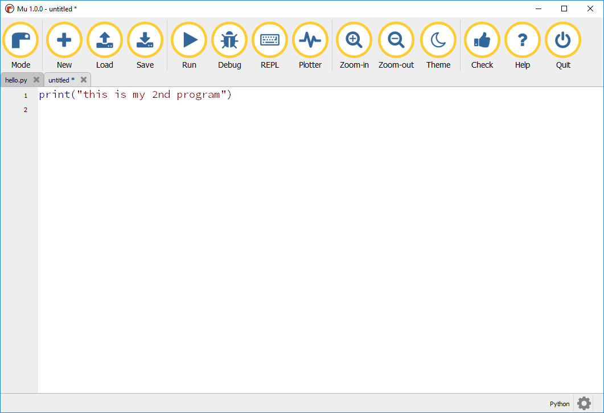

## Multiple programs

You can have multiple programs open at the same time using the tabs.

+ Click `New` to create a new program.

A second tab will appear where you can write you new program.

You can go between your 2 programs by clicking on the tabs.