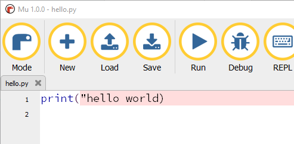
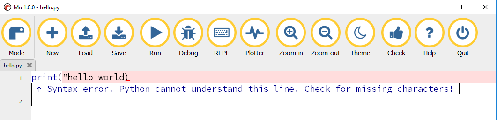

## Code checking and debugging

### Highlighting

Mu will try and help you create working code by checking your code for errors and highlighting any it finds to allow you to debug.

The following line of code is incorrect:

```python
print("hello world)
```

There is a `"` missing at the end of `"hello world`

If you run this program you will receive an error message:

```
File "c:\users\martin o'hanlon-lt\mu_code\hello.py", line 1
    print("hello world)
                      ^
SyntaxError: EOL while scanning string literal
```

Mu will highlight code which it recognises as incorrect.



### Checking

At any point while you're coding, you can also click the **Check** button to ask Mu to check your code for errors and provide advice.



When you have fixed an error, click **Check** again to see if the problem disappears.

### Debugging

Unfortunately not all problems with code are syntax errors (which Mu usually recognises). Some errors in your code will be **bugs**, meaning your program runs fine, but it doesn't do what you want it to do.

Mu has a debugger that allows you to step through your code line by line and look at what it is doing. Let's try it out!

- Copy and paste the following program into Mu. It is supposed to count down from 5 to 1.

```python
print("count down")
for count in range(5 , 1, -1):
    print(count)
```

- Now run it. You'll see that it only counts down to 2:

```
count down
5
4
3
2
```

You can debug this program by putting a **break point** into the code and using the **Debug** functions.

A break point marks a line within your program where the debugger will stop the program and wait.

+ Add a break point to the code by clicking the line number 2.

A red circle will appear next to line 2.


+ Click the **Debug** button to start the debugger.

The debugger will start, and your program will run until it gets to the break point.


The line of code highlighted is the code that will be run next.

There are four buttons in the menu that allow you to control the debugger:

+ **Continue**: starts your program again, which will then run until it hits another break point or finishes.

+ **Step Over**: runs the next line of code in your program

+ **Step In**: if the next line of code is a function, it will 'step in' the function and run it

+ **Step Out**: if the program is currently running a function, it will 'step out' of the function and return to the line of code which called the function.

There is also a Debug Inspector window of the right side of the code, showing the current value of any variables in use.

+ Click **Step Over** to run the next line of code.

The count variable will appear in the Debug Inspector.


+ Keep clicking **Step Over** to run through each line in the program. You will see that `count` never reaches `1`. This is because the `for` loop in the program does not reach `0`. This is what the program should look like:

```python
print("count down")
for count in range(5,0,-1):
    print(count)
```

