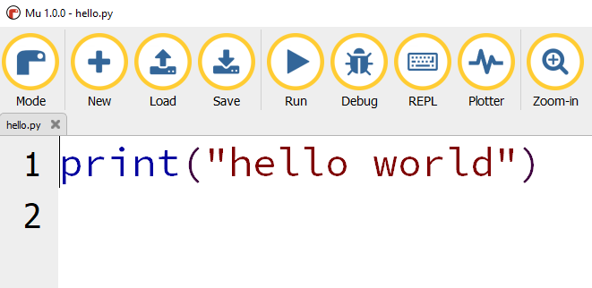
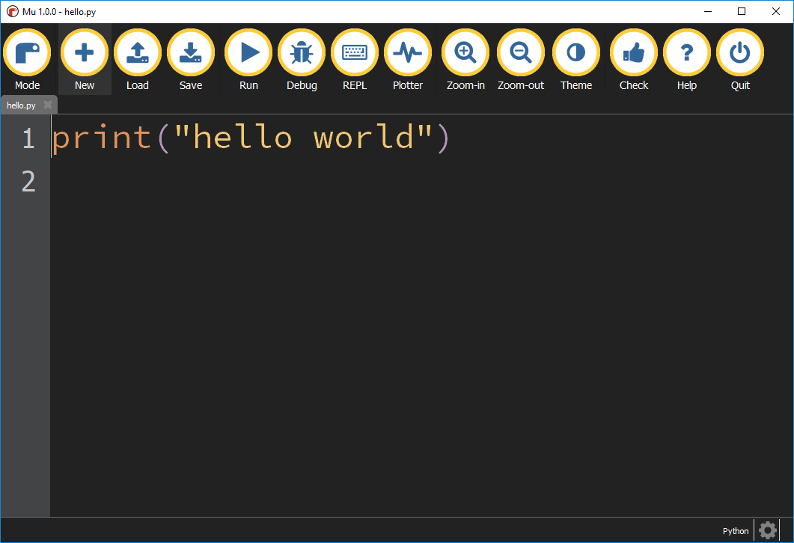

## Look and feel

### Text size

Using the `Zoom-in` and `Zoom-out` buttons you can change the size of the code.

### Themes

Mu comes with a number of color schemes or themes to suit different scenarios.

Clicking the `Theme` button will cycle through the different themes.

